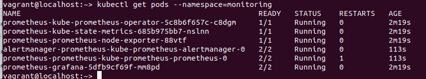
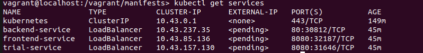

**Note:** For the screenshots, you can store all of your answer images in the `answer-img` directory.

## Verify the monitoring installation

*TODO:* run `kubectl` command to show the running pods and services for the three components. Copy and paste the output or take a screenshot of the output and include it here to verify the installation

***Monitoring***

```
NAME                                                     READY   STATUS    RESTARTS   AGE
prometheus-kube-prometheus-operator-5c8b6f657c-c8dgm     1/1     Running   0          2m19s
prometheus-kube-state-metrics-685b975bb7-nslnn           1/1     Running   0          2m19s
prometheus-prometheus-node-exporter-88vtf                1/1     Running   0          2m19s
alertmanager-prometheus-kube-prometheus-alertmanager-0   2/2     Running   0          113s
prometheus-prometheus-kube-prometheus-prometheus-0       2/2     Running   1          113s
prometheus-grafana-5dfb9cf69f-mm8pd                      2/2     Running   0          2m19s
```

***Jaegar***

```
NAME                               READY   STATUS    RESTARTS   AGE
jaeger-operator-6954c97677-5vf9v   1/1     Running   0          8m1s
```

***Services***


## Setup the Jaeger and Prometheus source
*TODO:* Expose Grafana to the internet and then setup Prometheus as a data source. Provide a screenshot of the home page after logging into Grafana.

***Grafana***


```
kubectl port-forward -n monitoring prometheus-grafana-5dfb9cf69f-mm8pd --address 0.0.0.0 3000:3000
```

## Create a Basic Dashboard
*TODO:* Create a dashboard in Grafana that shows Prometheus as a source. Take a screenshot and include it here.


## Describe SLO/SLI
*TODO:* Describe, in your own words, what the SLIs are, based on an SLO of *monthly uptime* and *request response time*.

Given SLO of *monthly uptime* and *request response time*, we have the following SLI definintion.

-  **Monthly uptime**: Here the SLI is defined by the measurment of the time within a calender month the service has been availlable.
- **Request response time**: Here the SLI is defined by the total time taken between  request for a service and the completing of the service that was requested.

## Creating SLI metrics.
*TODO:* It is important to know why we want to measure certain metrics for our customer. Describe in detail 5 metrics to measure these SLIs.
- 

## Create a Dashboard to measure our SLIs
*TODO:* Create a dashboard to measure the uptime of the frontend and backend services We will also want to measure to measure 40x and 50x errors. Create a dashboard that show these values over a 24 hour period and take a screenshot.

## Tracing our Flask App
*TODO:*  We will create a Jaeger span to measure the processes on the backend. Once you fill in the span, provide a screenshot of it here.

## Jaeger in Dashboards
*TODO:* Now that the trace is running, let's add the metric to our current Grafana dashboard. Once this is completed, provide a screenshot of it here.

## Report Error
*TODO:* Using the template below, write a trouble ticket for the developers, to explain the errors that you are seeing (400, 500, latency) and to let them know the file that is causing the issue.

TROUBLE TICKET

Name:

Date:

Subject:

Affected Area:

Severity:

Description:


## Creating SLIs and SLOs
*TODO:* We want to create an SLO guaranteeing that our application has a 99.95% uptime per month. Name three SLIs that you would use to measure the success of this SLO.

## Building KPIs for our plan
*TODO*: Now that we have our SLIs and SLOs, create KPIs to accurately measure these metrics. We will make a dashboard for this, but first write them down here.

## Final Dashboard
*TODO*: Create a Dashboard containing graphs that capture all the metrics of your KPIs and adequately representing your SLIs and SLOs. Include a screenshot of the dashboard here, and write a text description of what graphs are represented in the dashboard.  
